# 🏗️ Notification System - Complete API Flow Diagrams

## 📊 System Architecture Overview

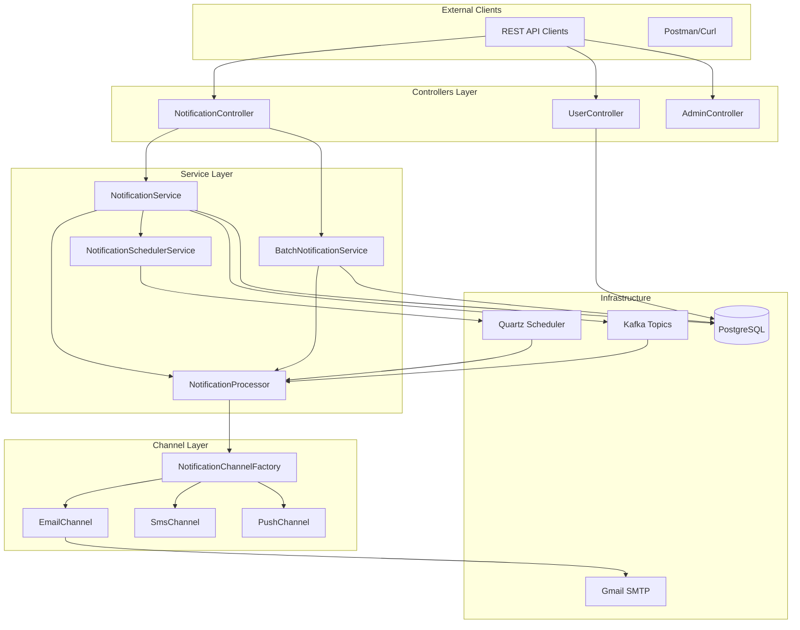

---

## 🔥 All API Endpoints Summary

| Method | Endpoint | Description | Flow Type |
|--------|----------|-------------|-----------|
| `POST` | `/api/v1/notifications` | Send notification | Immediate/Scheduled |
| `GET` | `/api/v1/notifications/{id}` | Get notification by ID | Simple Query |
| `GET` | `/api/v1/notifications/user/{userId}` | Get user notifications | Paginated Query |
| `POST` | `/api/v1/notifications/batch` | Send batch notifications | Complex Batch |
| `POST` | `/api/v1/users` | Create user | Simple CRUD |
| `GET` | `/api/v1/users` | Get all users | Simple Query |
| `GET` | `/api/v1/users/{id}` | Get user by ID | Simple Query |
| `GET` | `/api/v1/admin/channels` | Get available channels | Admin Info |
| `GET` | `/api/v1/admin/status` | Get system status | Admin Info |
| `GET` | `/api/v1/admin/scheduler/info` | Get scheduler info | Admin Info |
| `POST` | `/api/v1/admin/scheduler/cancel/{id}` | Cancel scheduled notification | Admin Action |

---

## 🎯 Key Flow Patterns

### 🚀 **Pattern 1: Immediate Notifications (with Kafka)**
```
API Request → NotificationService → Kafka Producer → Kafka Topic → Kafka Consumer → NotificationProcessor → Channel → SMTP/Console → Response
```

### ⏰ **Pattern 2: Scheduled Notifications (with Quartz)**
```
API Request → NotificationService → Quartz Scheduler → [Wait for Schedule] → NotificationJob → NotificationProcessor → Channel → SMTP/Console
```

### 📦 **Pattern 3: Batch Notifications**
```
API Request → BatchNotificationService → Create Multiple Notifications → [Parallel/Sequential Processing] → Individual Notification Flow → Aggregate Results → Response
```

### 📊 **Pattern 4: Simple CRUD Operations**
```
API Request → Controller → Repository → Database → Response
```

---

## 🔥 **1. POST /api/v1/notifications - Send Notification**

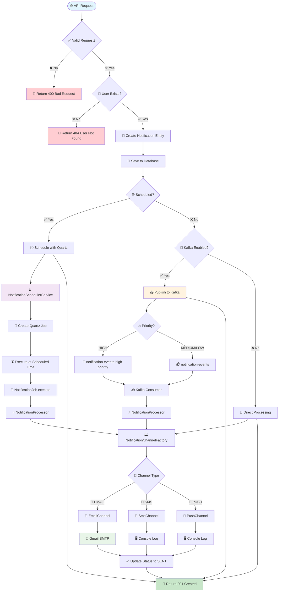

**Key Decision Points:**
- ⏰ **Scheduled?** → Use Quartz Scheduler (bypass Kafka)
- 📨 **Kafka Enabled?** → Async via Kafka OR Direct processing
- 🔥 **High Priority?** → Dedicated high-priority Kafka topic
- 📧 **Channel Type?** → EMAIL (real SMTP) vs SMS/PUSH (console)

---

## 📦 **2. POST /api/v1/notifications/batch - Batch Notifications**

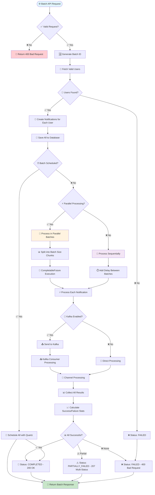

**Batch Processing Features:**
- 🚀 **Parallel Processing**: Uses `CompletableFuture` for concurrent execution
- 📊 **Batch Size Control**: Configurable chunk sizes
- ⏱️ **Delay Control**: Optional delays between batches
- 📈 **Statistics**: Tracks success/failure rates
- 🎯 **Continue on Error**: Optional error tolerance

---

## 📋 **Simple Query Endpoints**

### **3. GET /api/v1/notifications/{id}**
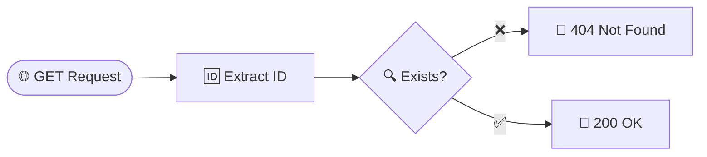

### **4. GET /api/v1/notifications/user/{userId}**
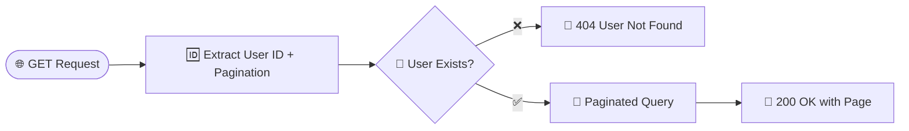

### **5-7. User Management Endpoints**
```mermaid
flowchart LR
    subgraph "User CRUD Operations"
        POST_USER[📝 POST /users<br/>Create User] --> DB[(💾 Database)]
        GET_USERS[📋 GET /users<br/>Get All Users] --> DB
        GET_USER[👤 GET /users/{id}<br/>Get User by ID] --> DB
    end
    DB --> SUCCESS[✅ Success Response]
```

---

## ⚙️ **Admin Endpoints**

### **8. GET /api/v1/admin/channels**
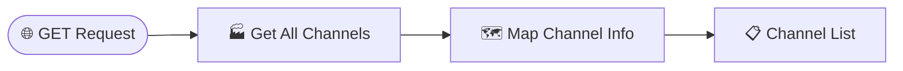

### **9. GET /api/v1/admin/status**
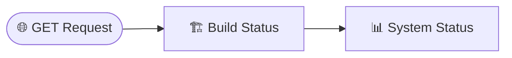

### **10. GET /api/v1/admin/scheduler/info**
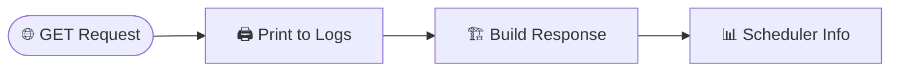

### **11. POST /api/v1/admin/scheduler/cancel/{id}**
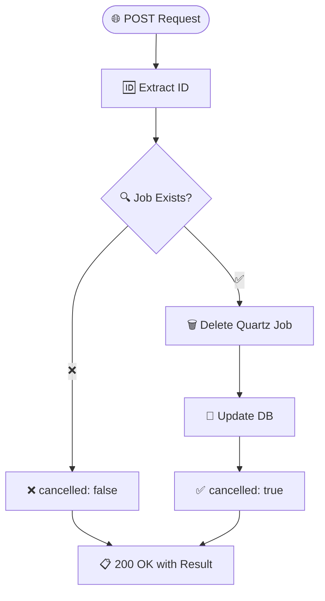

---

## 🔄 **Kafka Flow Details**

### **Kafka Topics & Consumers**
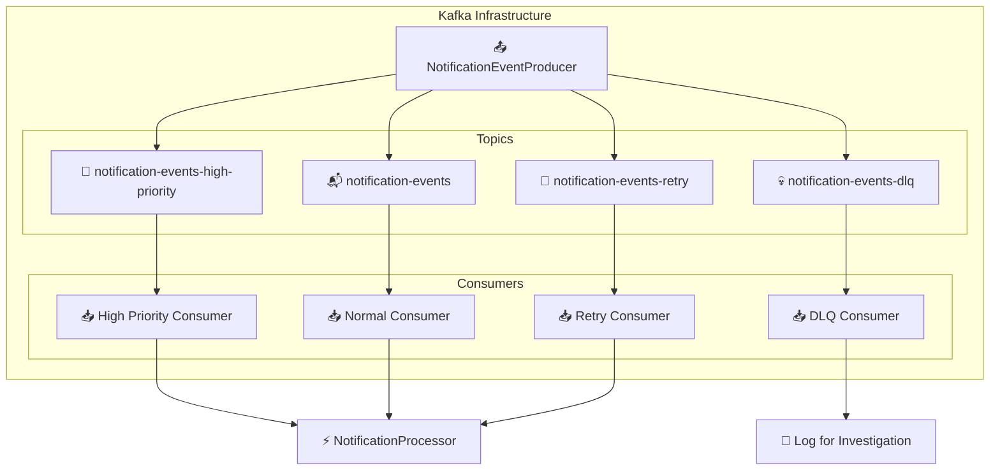

**Kafka Features:**
- 🔥 **Priority-based Topics**: High priority gets dedicated topic
- 🔄 **Retry Mechanism**: Automatic retry with exponential backoff
- 💀 **Dead Letter Queue**: Failed messages for investigation
- ⚡ **Async Processing**: Non-blocking notification delivery

---

## 🕐 **Quartz Scheduler Flow**

### **Scheduled Notification Lifecycle**
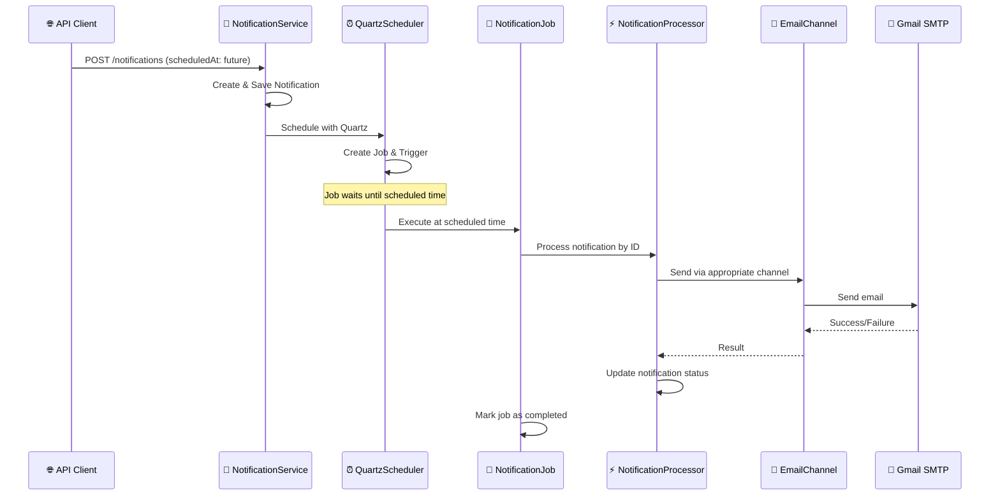

**Quartz Features:**
- ⏰ **Precise Scheduling**: Execute at exact future times
- 🔄 **Job Persistence**: Jobs survive application restarts
- 🚫 **Cancellation**: Cancel scheduled jobs via admin API
- 🔧 **Misfire Handling**: Smart handling of missed executions
- 📊 **Job Tracking**: Full lifecycle monitoring

---

## 📈 **Performance & Scaling Features**

### **Concurrency & Async Processing**
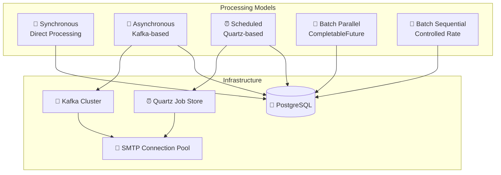

---

## 🛡️ **Error Handling & Reliability**

### **Error Response Codes**
| Code | Scenario | Description |
|------|----------|-------------|
| `200` | Success | Operation completed successfully |
| `201` | Created | Notification/User created successfully |
| `207` | Multi-Status | Batch partially failed |
| `400` | Bad Request | Invalid request data |
| `404` | Not Found | Resource not found |
| `500` | Server Error | Internal server error |

### **Retry Mechanisms**
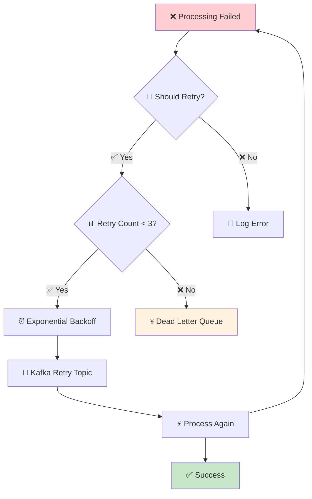

---

## 🎯 **Usage Examples**

### **1. Send Immediate High-Priority Email**
```bash
curl -X POST http://localhost:8080/api/v1/notifications \
  -H "Content-Type: application/json" \
  -d '{
    "userId": 1,
    "title": "🚨 Critical Alert",
    "content": "System maintenance in 5 minutes",
    "channelType": "EMAIL",
    "priority": "HIGH"
  }'
```
**Flow**: API → NotificationService → Kafka High-Priority Topic → Consumer → EmailChannel → Gmail SMTP

### **2. Schedule Email for Future**
```bash
curl -X POST http://localhost:8080/api/v1/notifications \
  -H "Content-Type: application/json" \
  -d '{
    "userId": 1,
    "title": "📅 Scheduled Reminder",
    "content": "Meeting tomorrow at 2 PM",
    "channelType": "EMAIL",
    "priority": "MEDIUM",
    "scheduledAt": "2025-09-08T14:00:00"
  }'
```
**Flow**: API → NotificationService → Quartz Scheduler → [Wait] → NotificationJob → EmailChannel → Gmail SMTP

### **3. Send Batch Notifications**
```bash
curl -X POST http://localhost:8080/api/v1/notifications/batch \
  -H "Content-Type: application/json" \
  -d '{
    "userIds": [1, 2, 3, 4, 5],
    "title": "📢 System Update",
    "content": "New features available",
    "channelType": "EMAIL",
    "priority": "MEDIUM",
    "batchSettings": {
      "batchSize": 2,
      "delayBetweenBatches": 1000,
      "parallelProcessing": true,
      "continueOnError": true
    }
  }'
```
**Flow**: API → BatchNotificationService → [Create 5 Notifications] → [Process in Batches of 2] → Kafka/Direct → EmailChannel → Gmail SMTP

---

## 📊 **System Configuration**

### **Key Configuration Properties**
```yaml
notification:
  kafka:
    enabled: true  # Enable/disable Kafka processing
    bootstrap-servers: localhost:9092
  channels:
    email:
      smtp:
        enabled: true  # Use real SMTP
      console:
        enabled: true  # Also log to console
    sms:
      twilio:
        enabled: false  # Use console mock
      console:
        enabled: true
```

### **Infrastructure Requirements**
- ☕ **Java 17+**
- 🐘 **PostgreSQL 12+** for data persistence
- 📨 **Apache Kafka** for async processing (optional)
- 📮 **SMTP Server** (Gmail) for email delivery
- 🚀 **Spring Boot 3.1.5** framework

---

This documentation provides a complete visual guide to your notification system's architecture and API flows! 🎉