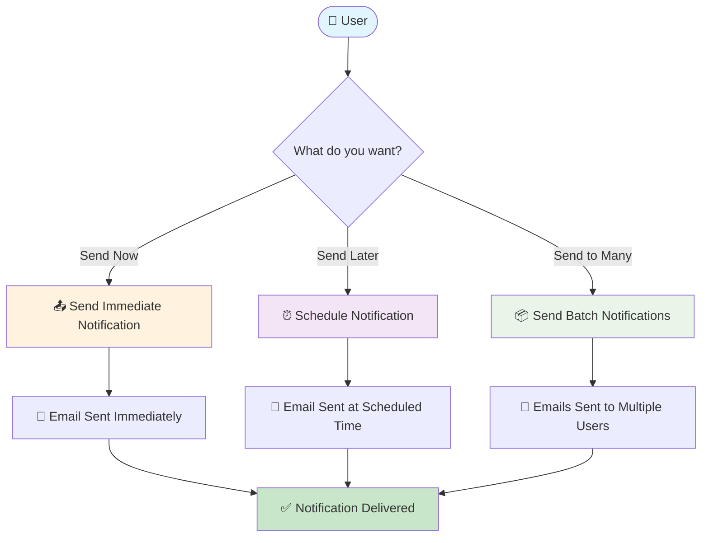
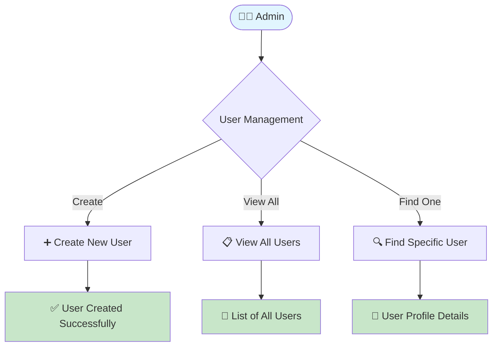
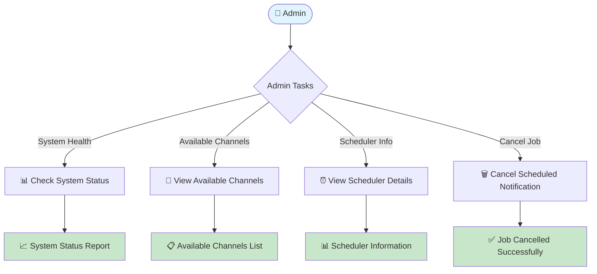
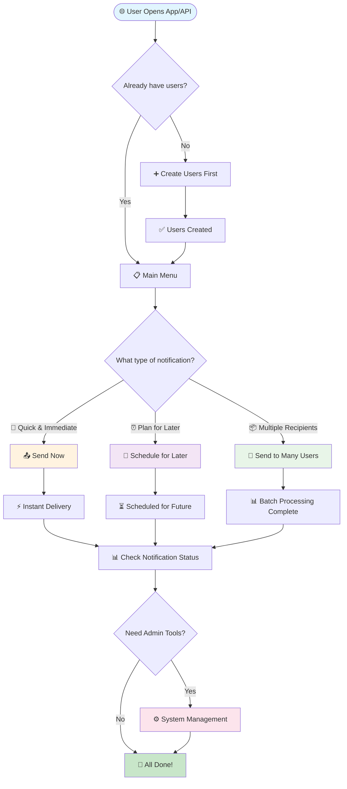
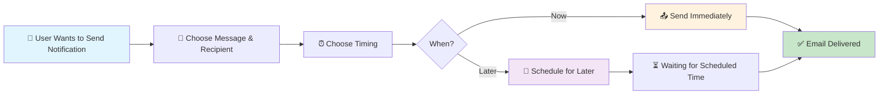
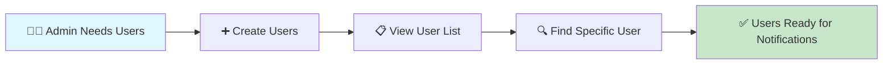
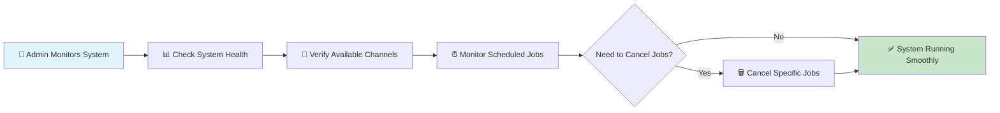
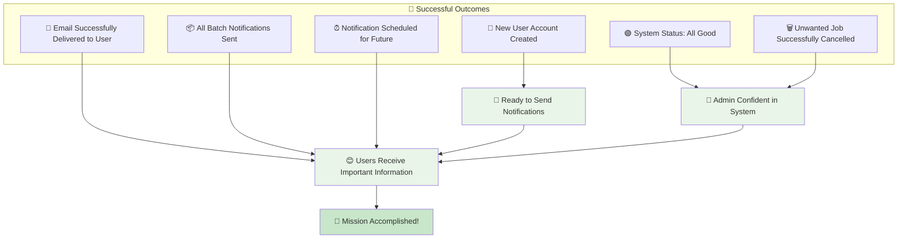

# 📱 Notification System - High Level User Flows

## 🎯 **Main User Flows**

### 📧 **1. Notification Flow**


### 👥 **2. User Management Flow**


### ⚙️ **3. Admin Flow**


---

## 🎭 **Complete User Journey**

### 📱 **From Start to Finish**


---

## 🎯 **Quick Decision Tree**

### 💭 **"What should I do?"**
```mermaid
flowchart TD
    QUESTION([🤔 What do you want to accomplish?]) --> PURPOSE{Your Goal}
    
    PURPOSE -->|📧 Send notifications to users| NOTIFY_FLOW[Go to Notification Flow]
    PURPOSE -->|👥 Manage user accounts| USER_FLOW[Go to User Management Flow]
    PURPOSE -->|⚙️ System administration| ADMIN_FLOW[Go to Admin Flow]
    
    NOTIFY_FLOW --> NOTIFY_TYPE{When to send?}
    NOTIFY_TYPE -->|Now| IMMEDIATE_BOX[📤 POST /notifications<br/>Immediate Delivery]
    NOTIFY_TYPE -->|Later| SCHEDULED_BOX[⏰ POST /notifications<br/>With scheduledAt]
    NOTIFY_TYPE -->|Multiple Users| BATCH_BOX[📦 POST /notifications/batch<br/>Batch Processing]
    
    USER_FLOW --> USER_TYPE{What user action?}
    USER_TYPE -->|Create| CREATE_BOX[➕ POST /users<br/>Create New User]
    USER_TYPE -->|View All| LIST_BOX[📋 GET /users<br/>List All Users]
    USER_TYPE -->|Find Specific| GET_BOX[🔍 GET /users/{id}<br/>Get User Details]
    
    ADMIN_FLOW --> ADMIN_TYPE{What admin task?}
    ADMIN_TYPE -->|System Health| STATUS_BOX[📊 GET /admin/status<br/>System Health Check]
    ADMIN_TYPE -->|Available Features| CHANNELS_BOX[📡 GET /admin/channels<br/>Available Channels]
    ADMIN_TYPE -->|Scheduler Management| SCHEDULER_BOX[⏰ GET /admin/scheduler/info<br/>Scheduler Details]
    ADMIN_TYPE -->|Cancel Scheduled Job| CANCEL_BOX[🗑️ POST /admin/scheduler/cancel/{id}<br/>Cancel Job]

    style QUESTION fill:#e1f5fe
    style IMMEDIATE_BOX fill:#fff3e0
    style SCHEDULED_BOX fill:#f3e5f5
    style BATCH_BOX fill:#e8f5e8
    style CREATE_BOX fill:#e8f5e8
    style LIST_BOX fill:#e8f5e8
    style GET_BOX fill:#e8f5e8
    style STATUS_BOX fill:#fce4ec
    style CHANNELS_BOX fill:#fce4ec
    style SCHEDULER_BOX fill:#fce4ec
    style CANCEL_BOX fill:#fce4ec
```

---

## 🚀 **Simple Action Flows**

### 📤 **Send Notification (Most Common)**


### 👥 **Manage Users**


### ⚙️ **System Administration**


---

## 📊 **Flow Summary Table**

| 🎯 **User Type** | 📋 **Main Actions** | 🔗 **API Endpoints** | 🎯 **Outcome** |
|------------------|---------------------|----------------------|-----------------|
| **👤 Regular User** | Send notifications | `POST /notifications`<br/>`POST /notifications/batch` | 📧 Emails delivered |
| **👥 User Manager** | Manage user accounts | `POST /users`<br/>`GET /users`<br/>`GET /users/{id}` | 👤 Users ready for notifications |
| **🔧 System Admin** | Monitor & control system | `GET /admin/status`<br/>`GET /admin/channels`<br/>`GET /admin/scheduler/info`<br/>`POST /admin/scheduler/cancel/{id}` | ⚙️ System running smoothly |
| **📊 Data Analyst** | Track notification history | `GET /notifications/{id}`<br/>`GET /notifications/user/{userId}` | 📈 Insights & reports |

---

## 🎉 **Success States**

### ✅ **Happy Path Results**


---

This high-level flow focuses on **user journeys** and **business outcomes** rather than technical implementation details! 🎯