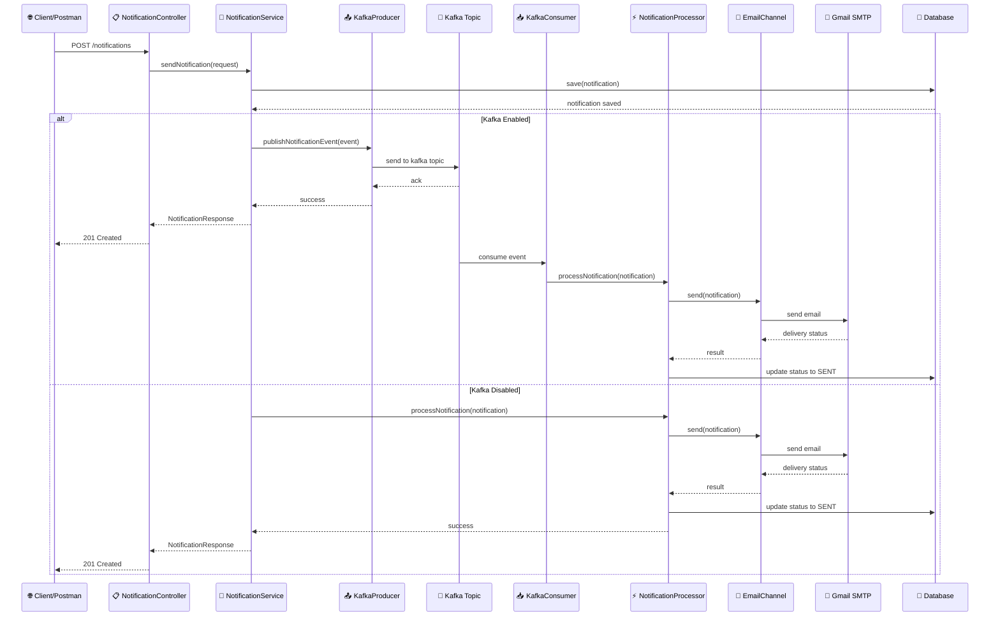
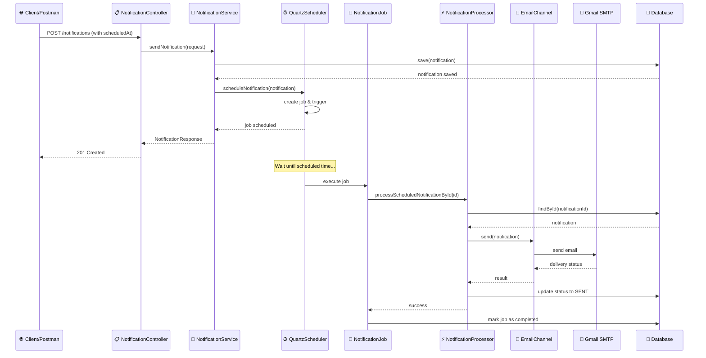
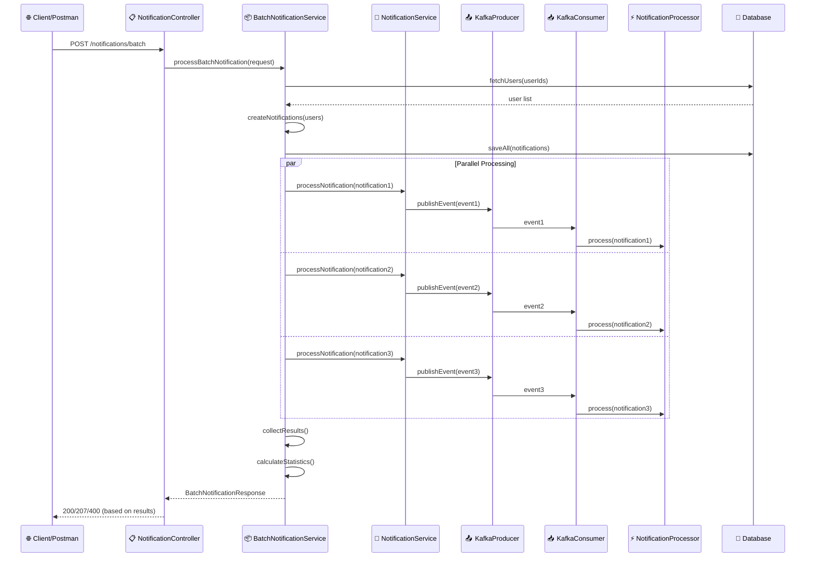
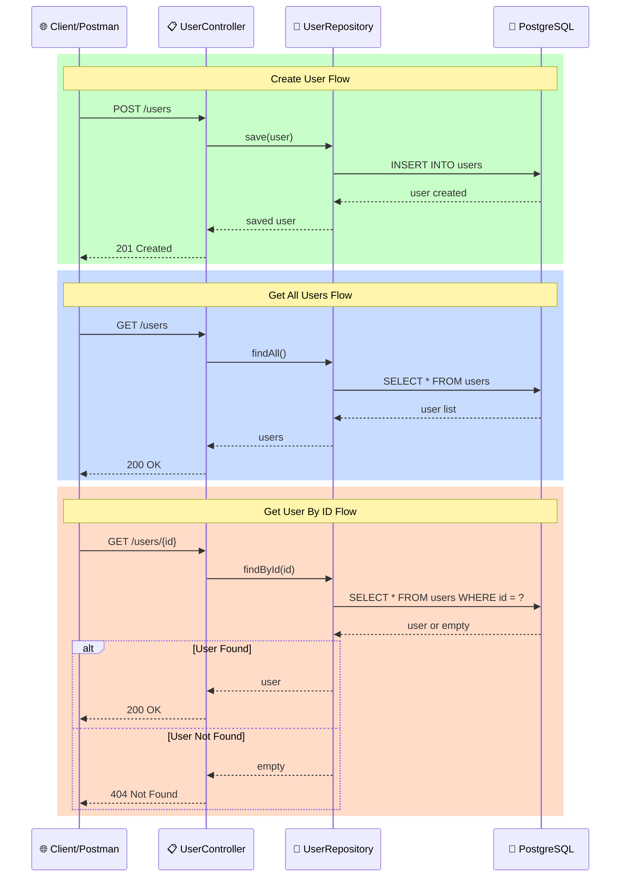
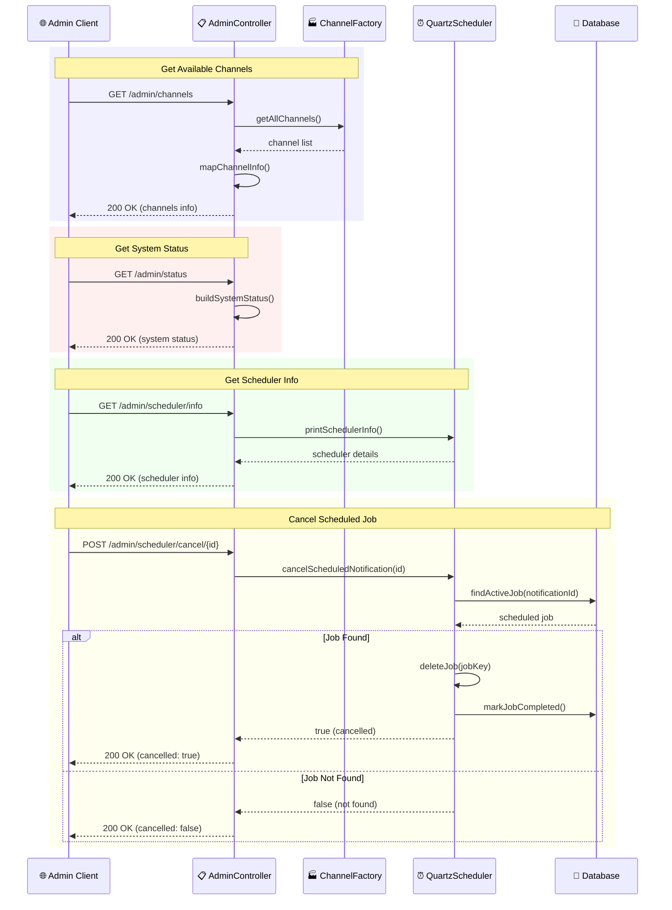
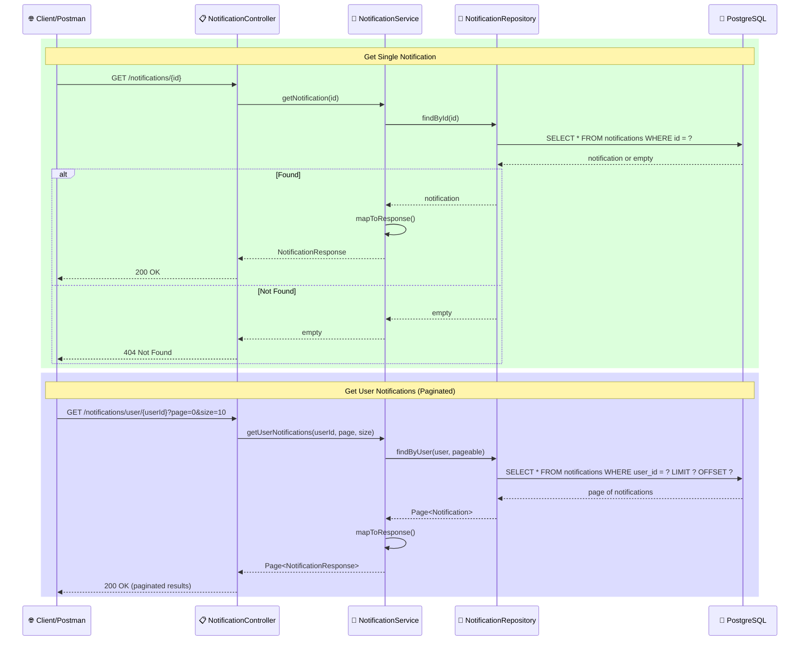
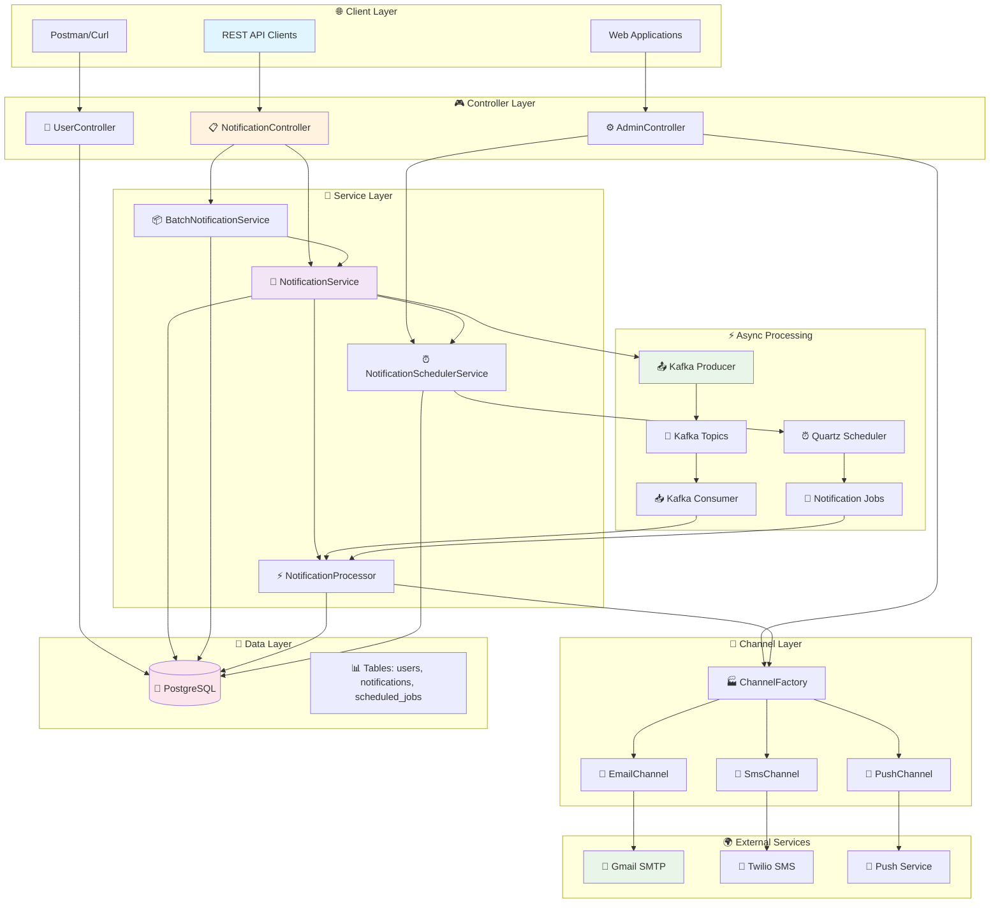
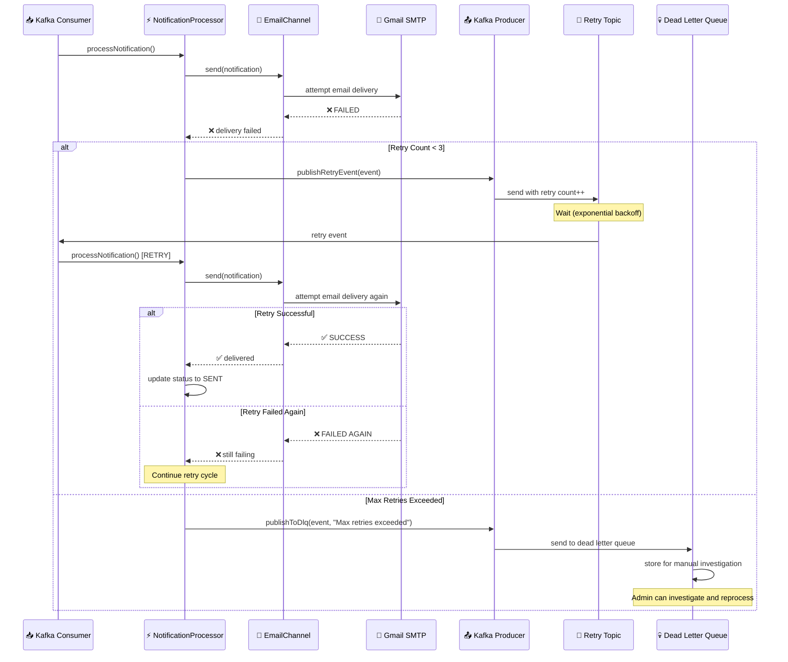
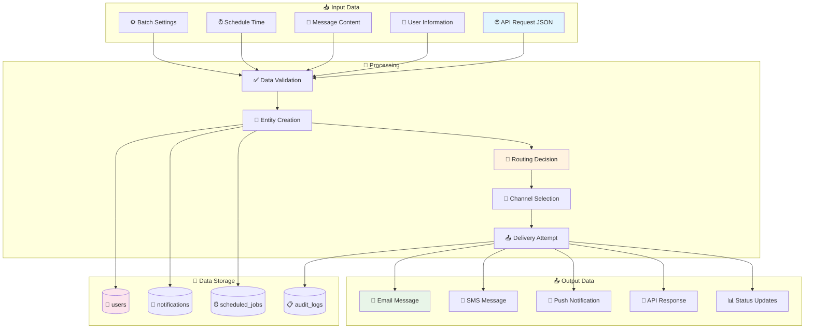

# 🔄 Notification System - System Interaction Diagrams

## 📧 **1. Send Immediate Notification Flow**

## ⏰ **2. Send Scheduled Notification Flow**

## 📦 **3. Send Batch Notifications Flow**

## 👥 **4. User Management Flow**

## ⚙️ **5. Admin Operations Flow**

## 🔍 **6. Query Notification Status Flow**

## 🏗️ **7. System Architecture Overview**

## 🔄 **8. Error Handling & Retry Flow**

## 📊 **9. Data Flow Diagram**

---

## 📋 **Component Interaction Summary**

| 🎯 **Flow Type** | 🔄 **Key Components** | 📊 **Data Flow** |
|------------------|----------------------|------------------|
| **📧 Immediate** | Controller → Service → Kafka → Consumer → Channel | Async via Kafka topics |
| **⏰ Scheduled** | Controller → Service → Quartz → Job → Channel | Delayed execution |
| **📦 Batch** | Controller → BatchService → Multiple async flows | Parallel/Sequential processing |
| **👥 User CRUD** | Controller → Repository → Database | Direct database operations |
| **⚙️ Admin** | Controller → Various Services → System info | System introspection |

This provides clear visual interaction flows that you can easily view in any markdown viewer that supports Mermaid diagrams! 🎉