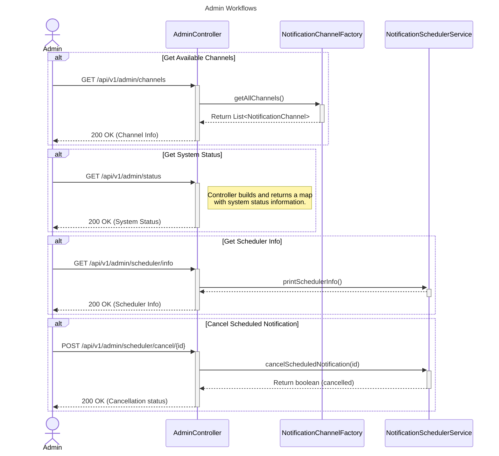

```mermaid
sequenceDiagram
    actor Admin
    participant AC as AdminController
    
    title Admin Workflows

    alt Get Available Channels
        participant Factory as NotificationChannelFactory
        Admin->>+AC: GET /api/v1/admin/channels
        AC->>+Factory: getAllChannels()
        Factory-->>-AC: Return List<NotificationChannel>
        AC-->>-Admin: 200 OK (Channel Info)
    end

    alt Get System Status
        Admin->>+AC: GET /api/v1/admin/status
        note right of AC: Controller builds and returns a map<br/>with system status information.
        AC-->>-Admin: 200 OK (System Status)
    end

    alt Get Scheduler Info
        participant SchedSvc as NotificationSchedulerService
        Admin->>+AC: GET /api/v1/admin/scheduler/info
        AC->>+SchedSvc: printSchedulerInfo()
        SchedSvc-->>-AC: 
        AC-->>-Admin: 200 OK (Scheduler Info)
    end

    alt Cancel Scheduled Notification
        participant SchedSvc as NotificationSchedulerService
        Admin->>+AC: POST /api/v1/admin/scheduler/cancel/{id}
        AC->>+SchedSvc: cancelScheduledNotification(id)
        SchedSvc-->>-AC: Return boolean (cancelled)
        AC-->>-Admin: 200 OK (Cancellation status)
    end
```