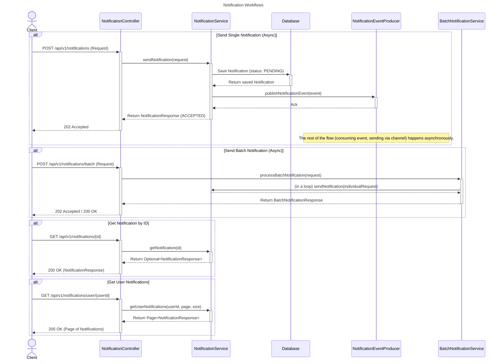

```mermaid
sequenceDiagram
    actor Client
    participant NC as NotificationController
    
    title Notification Workflows

    alt Send Single Notification (Async)
        participant NS as NotificationService
        participant DB as Database
        participant Prod as NotificationEventProducer
        
        Client->>+NC: POST /api/v1/notifications (Request)
        NC->>+NS: sendNotification(request)
        NS->>+DB: Save Notification (status: PENDING)
        DB-->>-NS: Return saved Notification
        NS->>+Prod: publishNotificationEvent(event)
        Prod-->>-NS: Ack
        NS-->>-NC: Return NotificationResponse (ACCEPTED)
        NC-->>-Client: 202 Accepted
        
        note over Prod: The rest of the flow (consuming event, sending via channel) happens asynchronously.
    end

    alt Send Batch Notification (Async)
        participant BNS as BatchNotificationService
        participant NS as NotificationService
        
        Client->>+NC: POST /api/v1/notifications/batch (Request)
        NC->>+BNS: processBatchNotification(request)
        BNS->>NS: (in a loop) sendNotification(individualRequest)
        NS-->>BNS: 
        BNS-->>-NC: Return BatchNotificationResponse
        NC-->>-Client: 202 Accepted / 200 OK
    end

    alt Get Notification by ID
        participant NS as NotificationService
        Client->>+NC: GET /api/v1/notifications/{id}
        NC->>+NS: getNotification(id)
        NS-->>-NC: Return Optional<NotificationResponse>
        NC-->>-Client: 200 OK (NotificationResponse)
    end

    alt Get User Notifications
        participant NS as NotificationService
        Client->>+NC: GET /api/v1/notifications/user/{userId}
        NC->>+NS: getUserNotifications(userId, page, size)
        NS-->>-NC: Return Page<NotificationResponse>
        NC-->>-Client: 200 OK (Page of Notifications)
    end
```