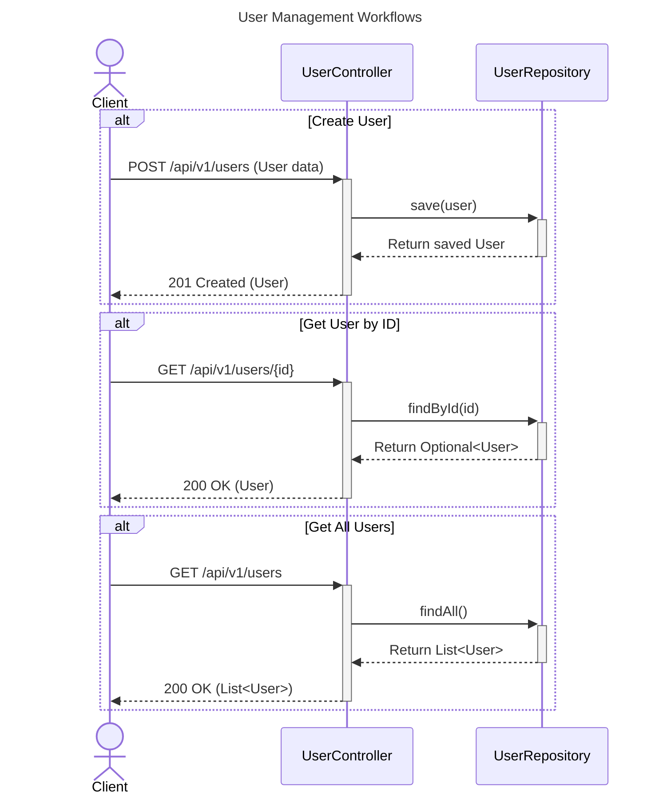

```mermaid
sequenceDiagram
    actor Client
    participant UC as UserController
    participant Repo as UserRepository

    title User Management Workflows

    alt Create User
        Client->>+UC: POST /api/v1/users (User data)
        UC->>+Repo: save(user)
        Repo-->>-UC: Return saved User
        UC-->>-Client: 201 Created (User)
    end

    alt Get User by ID
        Client->>+UC: GET /api/v1/users/{id}
        UC->>+Repo: findById(id)
        Repo-->>-UC: Return Optional<User>
        UC-->>-Client: 200 OK (User)
    end

    alt Get All Users
        Client->>+UC: GET /api/v1/users
        UC->>+Repo: findAll()
        Repo-->>-UC: Return List<User>
        UC-->>-Client: 200 OK (List<User>)
    end
```